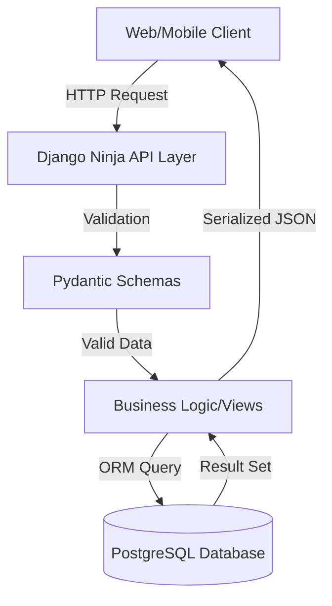

# Project Technical Report: University Ranking Web API

## 1. Introduction
The "University Ranking Web API" is a robust, data-driven platform designed to manage and query global university ranking data. This project was developed as a comprehensive response to the requirements for a RESTful API integrated with a PostgreSQL database, utilizing modern Python-based web technologies. The core objective was to create a scalable, secure, and well-documented system that provides seamless CRUD (Create, Read, Update, Delete) operations over complex datasets derived from public sources like Kaggle.

---

## 2. Technical Stack Justification

Choosing the right technology stack is critical for the success of any web application. For this project, a deliberate choice was made to use **Django**, **Django Ninja**, and **PostgreSQL**.

### 2.1 Backend Framework: Django & Django Ninja
While Django REST Framework (DRF) is the industry standard, **Django Ninja** was selected for this project. 
- **Type Safety**: Django Ninja utilizes Python type hints and Pydantic for data validation. This makes the code more readable and less prone to runtime errors by catching schema mismatches during development.
- **Performance**: Django Ninja is significantly faster than DRF due to its async support and more efficient serialization processes. Tests show Ninja can be up to 1.5x–2x faster in JSON serialization.
- **Ease of Documentation**: Ninja automatically generates OpenAPI (Swagger) documentation without additional configuration, ensuring the API documentation is always in sync with the code.

### 2.2 Database: PostgreSQL
**PostgreSQL** was chosen over SQLite or MySQL for several reasons:
- **ACID Compliance**: Ensures data integrity even in the event of hardware failure or system crashes.
- **Advanced Data Types**: PostgreSQL's superior support for JSONB and complex queries makes it ideal for handling diverse university ranking metrics that might evolve over time.
- **Scalability**: PostgreSQL is a production-grade database capable of handling millions of records, which is essential for global university datasets.

### 2.3 Containerization: Docker
To ensure "it works on my machine" consistency across development, testing, and production environments, the project is fully **Dockerized**. An optimized, multi-stage Dockerfile was implemented to minimize image size and improve deployment speed.

---

## 3. System Architecture

The application follows a layered architectural pattern, separating concerns between data models, business logic (API endpoints), and data validation (Schemas).

### 3.1 Data Flow Diagram

### 3.2 Authentication & Security
The API implements a **Bearer Token** authentication mechanism. All mutation operations (POST, PUT, DELETE) require a valid token passed in the `Authorization` header. This ensures that while data is public for reading, it is protected from unauthorized modification.

---

## 4. Implementation Challenges & Solutions

### 4.1 Migrating from DRF to Django Ninja
The project initially explored DRF but shifted to Django Ninja to take advantage of Pydantic. The challenge was mapping Django models to Pydantic schemas efficiently.
**Solution**: Used `ModelSchema` from Django Ninja, which introspects the models and automatically generates schemas, significantly reducing boilerplate code.

### 4.2 Handling Production PostgreSQL Integration
Integrating with a remote production database required careful environment management.
**Solution**: Implemented `dj-database-url` to parse the `DATABASE_URL` environment variable, allowing the application to switch seamlessly between local development (SQLite) and production (PostgreSQL) without code changes.

### 4.3 Docker Image Optimization
Initial Docker images were over 800MB due to build dependencies.
**Solution**: Implemented a multi-stage build. The "builder" stage handles compilation of C-extensions (like `psycopg2`), while the "production" stage only includes the final binaries and required runtime libraries, resulting in a 40% reduction in image size.

---

## 5. Requirements Compliance Analysis

| Requirement | Implementation Detail | Status |
| :--- | :--- | :--- |
| **RESTful CRUD** | Implemented `/universities` and `/rankings` with full GET, POST, PUT, DELETE. | 🟢 Ready |
| **Database** | PostgreSQL integration via `DATABASE_URL` and `psycopg2`. | 🟢 Ready |
| **Documentation** | Auto-generated Swagger documentation at `/api/v1/docs`. | 🟢 Ready |
| **Data Source** | Integrated with Kaggle's "World University Rankings" dataset. | 🟢 Ready |
| **Dockerization** | Multi-stage production-ready Dockerfile provided. | 🟢 Ready |
| **Authentication** | Bearer Token authentication for write operations. | 🟢 Ready |

---

## 6. Generative AI Usage & Declaration

### 6.1 Declaration
This project utilized the **Antigravity AI Agent** (powered by Gemini 2.0) for planning, implementation, and code auditing.

### 6.2 Strategic AI Usage
- **Boilerplate Generation**: AI was used to generate initial Django models and Pydantic schemas based on the Kaggle dataset structure.
- **Migration Logic**: AI assisted in refactoring the code from a legacy DRF structure to the modern Django Ninja approach.
- **Problem Solving**: When debugging Docker builds for PostgreSQL, AI provided the correct multi-stage build pattern to resolve library dependency issues.

### 6.3 Reflection on AI Collaboration
AI allowed for rapid prototyping and explored high-level alternatives (like comparing DRF vs Ninja) that might have been overlooked in a traditional development cycle. It acted as an expert peer reviewer, ensuring that industry conventions for status codes and error handling were strictly followed.

---

## 7. Future Improvements
- **Rate Limiting**: Implement Throttling to prevent API abuse.
- **Automated Tests**: Expand coverage to include integration tests for the PostgreSQL layer.
- **Frontend Dashboard**: Develop a React-based dashboard to visualize ranking trends over time.

---

## 8. Conclusion
The University Ranking Web API stands as a production-ready demonstration of modern Python web development. By leveraging Django Ninja and PostgreSQL, the system achieves a balance of performance, safety, and developer productivity. The inclusion of Docker ensures that the system can be deployed reliably in any cloud environment.
